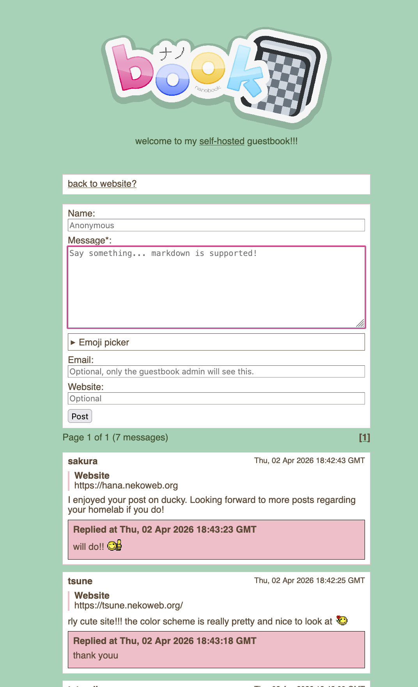

# nanobook

a self-hostable guestbook!

| screenshot                    |
|:-----------------------------:|
|  |

## prerequisites

- nothing!
- bun (for development and building, tested on bun 1.3.11)

## installation

1. download the latest release: https://github.com/yaaaarn/nanobook/releases
2. modify `config.yaml`
3. run!

### docker compose

coming soon...

## configuration

the configuration file should be located at `config.yaml`.

the port can be changed by setting the `PORT` environment variable.

### properties

see `config.example.yaml`

### development

```
# clone git repository
git clone https://github.com/yaaaarn/nanobook

# install dependencies
bun install
```

#### live server

this will open the server at http://localhost:3000.

```
bun run dev
```

#### building

running this will compile the entire source into a single-file executables for `darwin`,  `linux` (glibc + musl), and `windows` for both `x64` and `arm64` architectures.

```
bun run build
```

## license

MIT
